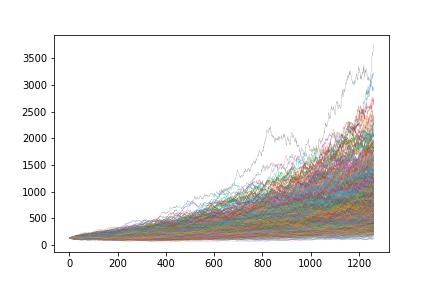
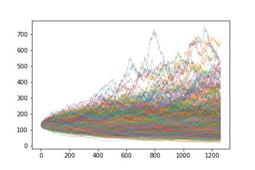

# How to simulate stock prices with Python

Simulate stock prices using Geometric Brownian Motion (GBM).

Simulating prices is fundamental for pricing derivatives. In the case of GBM, it is the key part of pricing equity options using Black-Scholes. Understanding how to simulate stock prices is foundational for any quantitative finance work. 

The good news?

You don’t need a master’s degree to build your own stock price simulator in Python.

## What is Geometric Brownian Motion?
 
Brownian motion comes from physics. It describes the random movement of particles in a substance. A Wiener process is a one-dimentional Brownian motion. It’s named after Norbert Wiener who won a Nobel Prize studying one-dimentional Brownian motions.

The Wiener process features prominently in quantitative finance because of some useful mathemetical properties.

The GBM is a continuous-time stochastic process where where the log of the random variable follows the Wiener process with drift.

It’s a data series that trends up or down through time with a defined level of volatility.

And it’s perfect for simulating stock prices.

---

## Step 1: Import the libraries

numpy

matplotlib

---

## Step 2: Set the input parameters
To simulate stock prices, we need some input parameters.

- setup params for brownian motion
Start by defining the initial stock price, s0. 
Then sigma which is the percentage volatility. 
Finally, mu (drift), which determine the overall trend.

- setup the simulation
Setup the simulation with 1,000 simulation paths. 
delta refers to the time step. 
I want to model a new stock price every day so I use 1/252 to represent 1 day in 252 trading days. 
The length of the simulation is 5 years.

---

## Step 3: Build the functions

- Build a function that returns a Wiener process. 
This function returns a 2-dimentional array with 1,260 rows and 1,000 columns. 
Each row is a day and each column is a simulation path.
Return an array of samples from a normal distribution

The Wiener process is also called Brownian motion. 
For more information about the Wiener process check out the Wikipedia page: 
http://en.wikipedia.org/wiki/Wiener_process

- Build a function that creates the GBM returns.
This method constructs random Geometric Brownian Motion (GBM).

- prepend a row of 1s to the returns array and multiply the starting stock price
- by the cumulative product of the GBM returns to produce the price paths.

---

## Step 4: Visualize the results

- Demonstrate two examples.

The first example simulates 1,000 price paths over 5 years. It starts at a price of 131 with 25% annualized volatility and 35% average return per year. This is the volatility and return of Apple in 2021.

a 35% drift causes most price paths to increase from from the initial price. In fact we can test exactly how many have increased from the initial price.

The second example, set the drift to 0.0.

A much different picture.

Only 402 prices end up higher than the original price.

---

Spend some time and play around with the variables. 

What happens if you double volatility? What happens if you set mu to a negative number?